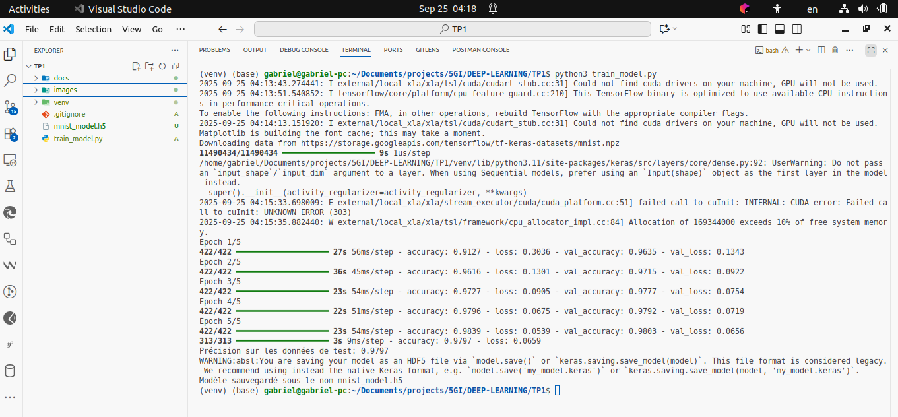

# TP : De la conception au déploiement de modèles de Deep Learning

Ce dépôt contient le travail réalisé dans le cadre du Travail Pratique (TP) du cours de Deep Learning pour les étudiants de 5ème année en Génie Informatique à l'ENSPY. L'objectif est de mettre en application le cycle de vie complet d'un modèle, de sa conception à sa préparation pour le déploiement, en utilisant des outils MLOps modernes.

## Table des matières

- [Contexte](#contexte)
- [Objectifs du TP](#objectifs-du-tp)
- [Aperçu du Résultat](#aperçu-du-résultat)
- [Technologies et Outils](#technologies-et-outils)
- [Structure du Projet](#structure-du-projet)
- [Comment Lancer le Projet](#comment-lancer-le-projet)
- [Auteur](#auteur)
- [Licence](#licence)

## Contexte

Ce projet est un travail académique visant à appliquer les concepts théoriques du Deep Learning et de l'ingénierie logicielle à un cas pratique : la classification d'images de chiffres manuscrits de la base de données MNIST.

## Objectifs du TP

- **Construire** un réseau de neurones avec TensorFlow/Keras.
- **Versionner** le code et les artefacts avec Git et GitHub.
- **Suivre** les expérimentations (paramètres, métriques) avec MLflow.
- **Exposer** le modèle via une API web avec Flask.
- **Conteneuriser** l'application avec Docker pour un déploiement reproductible.

## Aperçu du Résultat

Le script principal `train_model.py` entraîne un réseau de neurones sur le jeu de données MNIST et atteint une précision supérieure à 97% sur l'ensemble de test.



## Technologies et Outils

- **Langage** : Python 3
- **Frameworks de Deep Learning** : TensorFlow, Keras
- **Ingénierie MLOps** : MLflow, Flask, Docker
- **Versionnement** : Git, GitHub

## Structure du Projet

```
.
├── docs/
│   ├── enonce/         # Contient l'énoncé du TP
│   └── rapport/        # Contient la version PDF du rapport final
├── images/             # Captures d'écran utilisées dans le rapport
├── train_model.py      # Script principal pour l'entraînement du modèle
├── mnist_model.h5      # Le modèle de neurones entraîné et sauvegardé
├── app.py              # (À venir) API Flask pour servir le modèle
├── requirements.txt    # (À venir) Dépendances du projet
├── Dockerfile          # (À venir) Fichier de configuration Docker
└── README.md           # Ce fichier
```

## Comment Lancer le Projet

1.  **Clonez le dépôt :**
    ```bash
    git clone https://github.com/NOMO-Gabriel/TP1_DEEP_LEARNING_5GI.git
    cd TP1_DEEP_LEARNING_5GI
    ```

2.  **Créez et activez l'environnement virtuel :**
    ```bash
    python3 -m venv venv
    source venv/bin/activate
    ```

3.  **Installez les dépendances :**
    *(Note : Le fichier `requirements.txt` sera créé dans l'exercice 4. Pour l'instant, installez manuellement.)*
    ```bash
    pip install tensorflow numpy
    ```

4.  **Exécutez le script d'entraînement :**
    ```bash
    python train_model.py
    ```
    Ceci va entraîner le modèle et créer le fichier `mnist_model.h5`.

## Auteur

**NOMO BODIANGA GABRIEL NASAIRE JUNIOR**
- GitHub: [@NOMO-Gabriel](https://github.com/NOMO-Gabriel)

## Licence

Ce projet est distribué sous la licence MIT.
